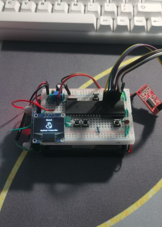
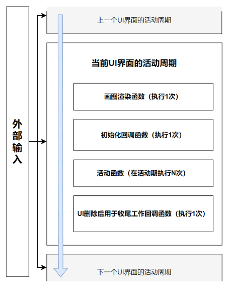
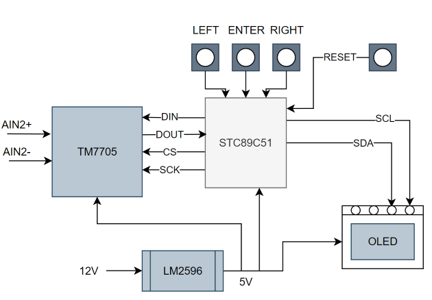
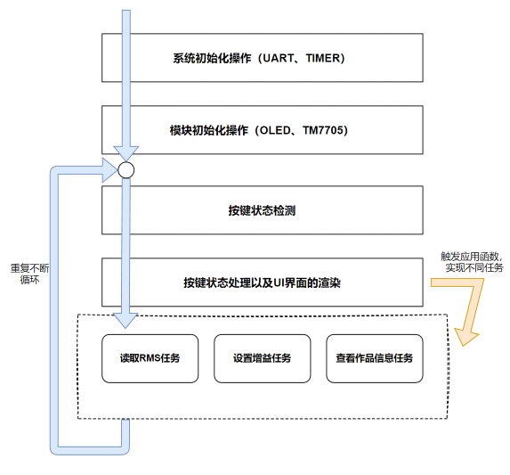

# 简易·快速移植的小型指针菜单框架——MyUI

   

**特点：**

1. 借鉴了安卓系统的活动运作机制以及LVGL小型嵌入式开源图形库的原理，进行了重头到尾的新的设计，裁剪了一些复杂无用的功能（比如事件机制、样式渲染机制、多显示设备驱动），**使总体核心代码限制在300行以内**，对于51等低容量MCU的程序存储空间很友好。

   

2. 采用链表结构使得菜单便于搭建、拓展。

3. 该框架基于C51语言开发，提供了相关移植接口，方便菜单的移植

4. 适用于单色屏，示例项目使用中景园1.54寸oled屏幕驱动，同时也支持其他IPS屏幕，仅需按照接口定义进行修改即可

PS. 	配套资料中的"docs/实验.docx"文档中对于MyUI框架有详细的代码介绍，包括代码中注释也非常详细，便于大家参考学习、移植。

配套菜单的示例选题为**数字交流电压表的设计**，以下是项目大体介绍。（详细见"实验.docx"文档）

> 以MCS-51单片机为核心，设计一个交流数字电压表，交流信号由变压器提供，二次侧0-5V AC，匝数比200:1。测量值显示在LCD显示器上，被测电压由8位AD转换器将模拟量转换成数字量信号有：启动转换信号（START,输出），转换结束(EOC, 输入)和读控制信号（OE，低电平有效）；另外，可以选择测量量程，例如通过单片机输出一个3位二进制数来选择不同的前置放大器增益。
>
> **硬件方面：**主控采用宏晶科技的STC89C52RC,使用面包板搭建51的最小系统。该系统包含晶振电路、按键输入电路、电阻分压电路以及若干外部模块接口。使用的模块有：一块0.95寸IIC驱动的OLED屏幕，双路16bit高精度ADC转换模块TM7705，DC-DC降压稳压模块LM2596。
>
> **软件方面：**主要分为OLED的IIC通信驱动函数以及相关画图函数、TM7705的SPI驱动函数以及RMS计算函数、按键处理逻辑及菜单UI逻辑框架。
>
> 整体的硬件电路框架如下图所示：
>
>   
>
> 整体的软件框架如下：
>
> 
